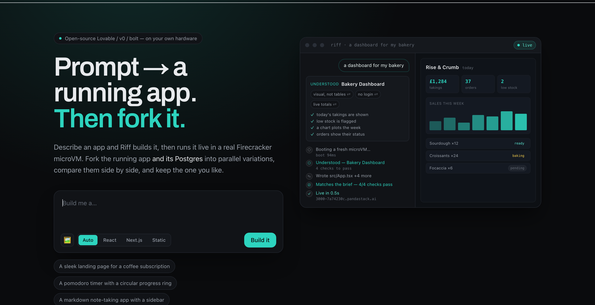

<div align="center">

# ⑂ Riff

### Prompt → a running full-stack app. Then fork it.

**Open-source, self-hostable Lovable / v0 / bolt — where every app runs in a real
Firecracker microVM, stays live forever for ~$0, and you can fork the running app
*and its database* to explore variations in parallel.**

</div>

<p align="center">
  
</p>

---

Describe an app. Riff builds it and runs it live on a real microVM in about a
second. Then — the part nothing else can do — **fork the running app into N live
variations, compare them side by side, and keep the one you like.** Each branch is
a genuine isolated VM (with its own cloned Postgres), not a browser tab.

## Why Riff exists

Lovable, v0, and bolt are closed SaaS, and every one of them hits the same walls:

| Their wall | How Riff removes it |
|---|---|
| Toy/ephemeral backends (browser sandboxes, WebContainers) | Real Firecracker **microVMs** — any framework, real servers, background jobs, **managed Postgres** |
| Not self-hostable | Runs entirely on **your own [PandaStack](https://pandastack.ai) cluster** — one bare-metal box will do |
| Weak isolation (generated code runs in a browser tab or shared infra) | **KVM microVM isolation** — safe to run whatever the model emits; the orchestrator *never* evals generated code |
| Previews expire or meter | **Scale-to-zero** — an idle app costs ~storage-only and wakes in ~1s, so every generation stays live |
| One linear thread | **Fork the running app + DB** into N live branches — the fork *tree* is your history |

## What it does today

- **Prompt → running app** in ~1s (React), served at a stable live URL.
- **Multiple frameworks** — React (Vite), Next.js, and static — auto-detected or picked.
- **Managed Postgres per project** — attach a real database; the agent writes migrations and queries it server-side.
- **Image-to-code** — drop a screenshot, get the UI in code (GPT-4o vision).
- **In-app image generation** — the app references `/riff-gen/<description>.png` and Riff fills in real generated images.
- **Theme panel** — restyle the whole app (accent, style, light/dark) in one click.
- **Checkpoints / time-travel** — every build is a restorable version.
- **⑂ Fork-to-explore** — one prompt → N live branches (app + cloned DB) side by side → keep the winner. **The moat.**
- **⑉ Understands the ask** — before it builds, Riff writes a **Brief**: what it understood, what it is assuming, and the checks the finished app must pass. When a prompt genuinely reads two ways, it doesn't interrogate you — it builds the likely one and offers to **fork the running app into the other reading** so you can pick by looking.
- **Acceptance-checked builds** — after the app is live, Riff screenshots it and judges it against the Brief. A blank page, a crashed component, or a *"chart coming soon"* placeholder is a **failure**, not a success, and goes straight back into the self-fix loop.
- **⛁ Bring your own data** — drop a CSV or JSON in with the prompt. Riff reads the real columns, builds the UI around your actual rows, and (with Postgres attached) loads the whole file into a real table first.
- **It learns what you like** — every time you keep one forked variation over another you are teaching it. Riff distils that into a short, editable note and applies it to later builds. No preferences form; no other builder has the signal.
- **Model-agnostic** — OpenAI or Anthropic; a deterministic template generator runs with no key at all.

## Quickstart

```bash
git clone <your-fork-url> riff && cd riff
npm install
cp .env.local.example .env.local     # add PANDASTACK_API_KEY + OPENAI_API_KEY
npm run dev                           # → http://localhost:4321
```

You need two things in `.env.local`:

- **`PANDASTACK_API_KEY`** — the compute layer. Grab one at [app.pandastack.ai](https://app.pandastack.ai), or point `PANDASTACK_API_URL` at your own self-hosted cluster.
- **`OPENAI_API_KEY`** (or `ANTHROPIC_API_KEY`) — the codegen model. Without one, a built-in template generator still runs the whole pipeline end-to-end.

Then open **http://localhost:4321**, describe an app, and watch it come up live.

## How it works

```
 Browser (Next.js UI)
   ├─ chat + streaming build steps        ├─ live preview iframe
   └─ ⑂ Branch — the fork wall            └─ 🎨 theme · ＋Postgres · checkpoints
         │  REST + SSE
         ▼
 Riff orchestrator (Next.js route handlers)
   ├─ intent layer: prompt → Brief (understanding, assumptions, acceptance)
   ├─ agent loop: generate → write → run → observe logs → self-fix → live
   ├─ verify: screenshot the LIVE app, click through it → judge vs the Brief → fix
   ├─ codegen providers (OpenAI / Anthropic / template)
   └─ PandaStack SDK client  ── never runs generated code itself
         │
         ▼
 PandaStack cluster (self-hosted or managed)
   ├─ one persistent microVM per project → stable preview URL
   ├─ managed Postgres per project
   ├─ fork()   → branch app + DB (CoW mem/disk)   ← the moat
   ├─ snapshot()→ checkpoints
   └─ scale-to-zero → idle ≈ $0, wake ~1s
```

**One project = one microVM (+ its Postgres).** A branch is a copy-on-write
`fork()` of that VM plus a point-in-time clone of its database. Because the
orchestrator only ever drives the PandaStack SDK — it never `eval`s generated
code — the security story is real KVM isolation, not a sandboxed browser tab.

## Self-hosting

Riff is the OSS builder; [PandaStack](https://pandastack.ai) is the compute layer.
Run PandaStack on your own bare-metal box (native KVM) and point `PANDASTACK_API_URL`
at it, and the whole thing — generated apps, databases, forks — runs on your own
hardware. Apache-2.0/MIT; no lock-in.

## Status

Built and live-verified: prompt→app, multi-framework, checkpoints, managed
Postgres, image-to-code, in-app image generation, the theme panel, the
fork-to-explore moat, and the whole **intent layer** — the Brief, fork-to-resolve,
acceptance checking (including scripted interactions) against the running app,
context-aware follow-ups, data drop, and taste memory. The plan, what it cost, and
what building it taught us is written up in
[docs/understanding-plan.md](docs/understanding-plan.md).

`GET /api/metrics` reports whether any of it is actually working, computed from a
local event log. Nothing leaves your machine.

Next: one-command self-host, a public gallery of live apps, and two-way GitHub sync.

## License

MIT — see [LICENSE](LICENSE).
